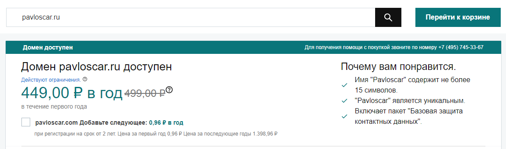
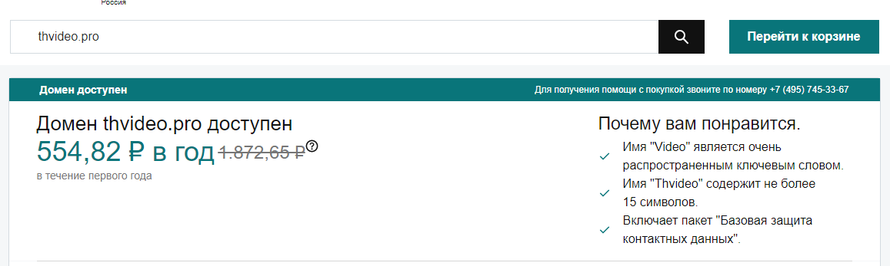
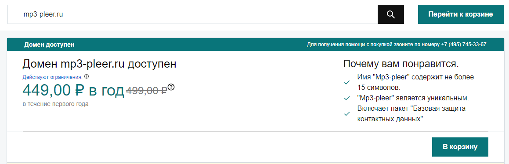

# free-blocked-domain

[output](output.txt)

## Поиск свободных для регистрации доменов в реестре запрещённых сайтов
Усилия Роскомнадзора привели к тому, что в реестре многие сайты остаются надолго. 

Это открывает возможности для злоумышленников по регистрации доменов, которые заблокированы и больше не востребованы владельцами.

История проблемы рассмотрена в статьях:

 https://usher2.club/articles/dns-attack-2017/

 https://roskomsvoboda.org/24044/

Используя доступный реестр запрещенных сайтов (https://reestr.rublacklist.net/article/api) проведите его анализ ​на наличие доменов, доступных по HTTPS и свободных для регистрации.

Вам потребуется:

1) Найти в реестре запрещённых сайтов домены с https (из всего URL нужно взять только домен)

2) С помощью API http://api.whois.vu/?q=i7.ru или аналогичного проверить, есть ли среди них доступные для регистрации . 

Можно использовать готовые библиотеки
Java - org.apache.commons.net.whois.WhoisClient;

Python - https://pypi.org/project/python-whois/

3) Выбрать несколько доменов и проверить вручную возможность их покупки на сайтах доменных регистраторов (NIC.ru, REG.ru или любом другом).

В качестве ответа приложите: выгрузку использованного реестра, исходный код программы, выбранные Вами домены и скриншоты, подтверждающие доступность их покупки (регистрации).
